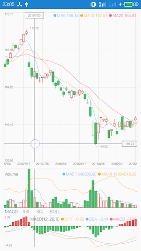
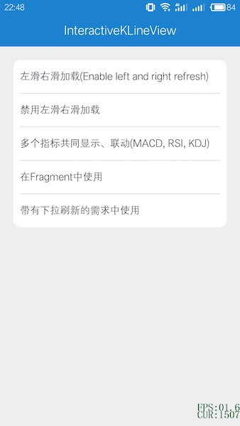
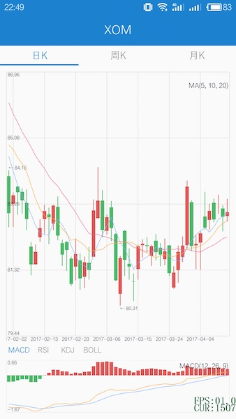
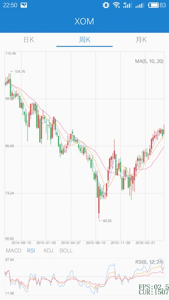
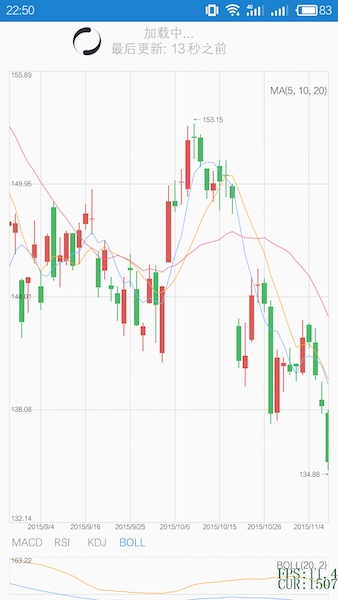
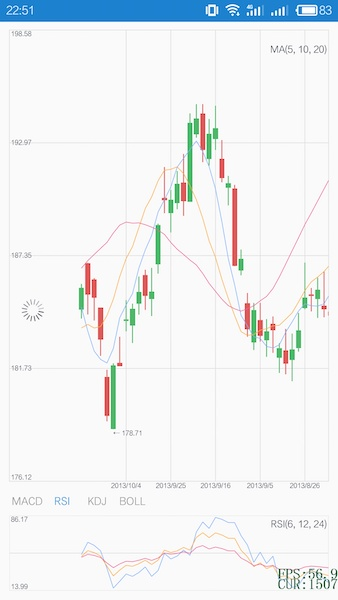
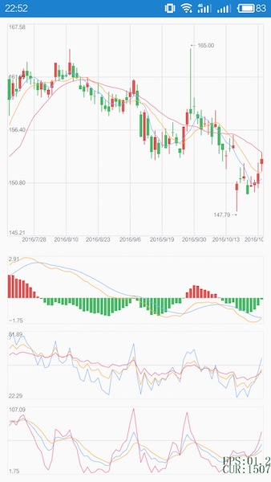
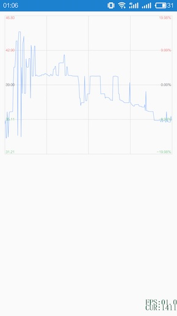

## Features

当前最新版本：0.1.5

支持在 XML 布局文件和代码中设置各个线条颜色、大小配置

支持左滑、右滑加载

支持长按高亮、短按点击、双指缩放事件

支持 fling 滑动

支持 MACD、RSI、KDJ、BOLL 四个指标

支持自定义的指标显示方式

> 附带的程序示例有：默认左滑右滑加载、禁用左滑右滑加载、多个指标共同联动显示、在 Fragment 中使用、带有下拉刷新的需求中使用、横竖屏切换（自动旋转）、简单分时图

## Change log

> 2017.06.28

增加 K线图成交量柱状图



查看全部日志：[https://github.com/wordplat/ikvStockChart/blob/master/CHANGE_LOG.md](https://github.com/wordplat/ikvStockChart/blob/master/CHANGE_LOG.md)

## Usage

```groovy
repositories {
    jcenter()
}

dependencies {
    compile 'com.wordplat:ikvStockChart:0.1.5'
}
```

```xml
<com.wordplat.ikvstockchart.InteractiveKLineLayout
        android:id="@+id/kLineLayout"
        android:layout_width="match_parent"
        android:layout_height="match_parent" />
```

```java
        final EntrySet entrySet = new EntrySet();
        entrySet.addEntry(new Entry(...));
        
        kLineLayout.getKLineView().setEntrySet(entrySet);
        kLineLayout.getKLineView().notifyDataSetChanged();
        kLineLayout.getKLineView().setKLineHandler(new KLineHandler() {
            @Override
            public void onLeftRefresh() {
                kLineLayout.getKLineView().refreshComplete();
            }

            @Override
            public void onRightRefresh() {
                kLineLayout.getKLineView().refreshComplete();
            }

            @Override
            public void onSingleTap(MotionEvent e, float x, float y) {

            }

            @Override
            public void onDoubleTap(MotionEvent e, float x, float y) {

            }

            @Override
            public void onHighlight(Entry entry, int entryIndex, float x, float y) {

            }

            @Override
            public void onCancelHighlight() {

            }
        });
```

ikvStockChart 支持 66 个属性配置，设置各个线条颜色大小参考 [https://github.com/wordplat/ikvStockChart/blob/master/PROPERTY.md](https://github.com/wordplat/ikvStockChart/blob/master/PROPERTY.md)

```java
        SizeColor sizeColor = kLineLayout.getKLineView().getRender().getSizeColor();
        sizeColor.setXXX();
```


## Screenshot

        

        



## Dependency

none

## License

```java
/*
 * Copyright (C) 2017 WordPlat Open Source Project
 *
 *      https://wordplat.com/InteractiveKLineView/
 *
 * Licensed under the Apache License, Version 2.0 (the "License");
 * you may not use this file except in compliance with the License.
 * You may obtain a copy of the License at
 *
 *      http://www.apache.org/licenses/LICENSE-2.0
 *
 * Unless required by applicable law or agreed to in writing, software
 * distributed under the License is distributed on an "AS IS" BASIS,
 * WITHOUT WARRANTIES OR CONDITIONS OF ANY KIND, either express or implied.
 * See the License for the specific language governing permissions and
 * limitations under the License.
 */
```